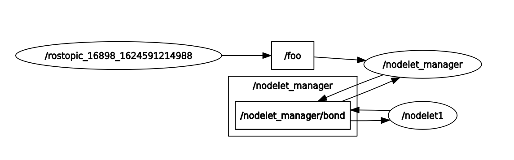
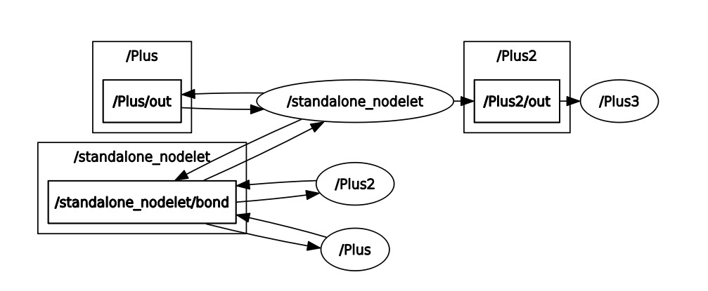

## nodelet

nodelet的作用是在同一个进程中让节点之间 通过共享内存的方式来通信，实现数据的快速传输

1. 用法

```bash
# 在nodelet_manager_name中实例化pkg/Class类型的nodelet，可以使用相同指令实例化多个nodelet，这样在同一个manager下的多个nodelet之间可以进行共享内存
rosrun nodelet nodelet load pkg/Class __name:=nodelet_manager_name

# 以standalone的模式实例化pkg/Class类型的nodelet，相当于有一个节点 包含pkg/Class实例在运行
rosrun nodelet nodelet standalone pkg/Class
```

2. 使用时自定义类时要public的方式继承`nodelet::Nodelet`

### Demo

[nodelet/Tutorials/Running a nodelet](http://wiki.ros.org/nodelet/Tutorials/Running%20a%20nodelet)

``` bash
# bring up a nodelet managet called nodelet_manager
rosrun nodelet nodelet manager __name:=nodelet_manager

# Launch a nodelet of type pkg/Type on nodelet_manager manager，命名为nodelet1
rosrun nodelet nodelet load nodelet_tutorial_math/Plus nodelet_manager __name:=nodelet1 nodelet1/in:=foo _value:=1.1

# 手动发布话题/foo
rostopic pub /foo std_msgs/Float64 5.0 -r 10

rostopic echo /nodelet1/out
```

节点图如下：

话题/foo的消息先传给 节点，然后再通过话题/nodelet_manager/bond传给nodelet1




`launch文件demo`

``` bash 
roslaunch nodelet_tutorial_math plus.launch
```

通过launch启动多个Plus节点，实现 /Plus/in + 1 + 10 + 2.5 

解释：Plus，Plus2同在/standalone_nodelet这个nodelet manager下，所以他们之间的信息传输不是通过网络的，而是通过**进程内共享内存方式通信**。Plus2 与 Plus3之间的通信是通过ROS master进行的

